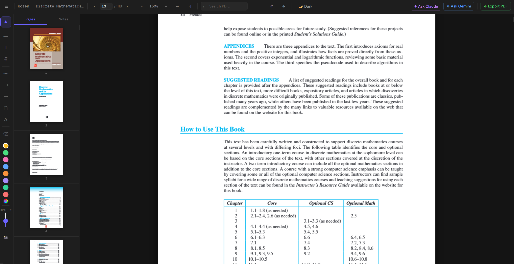
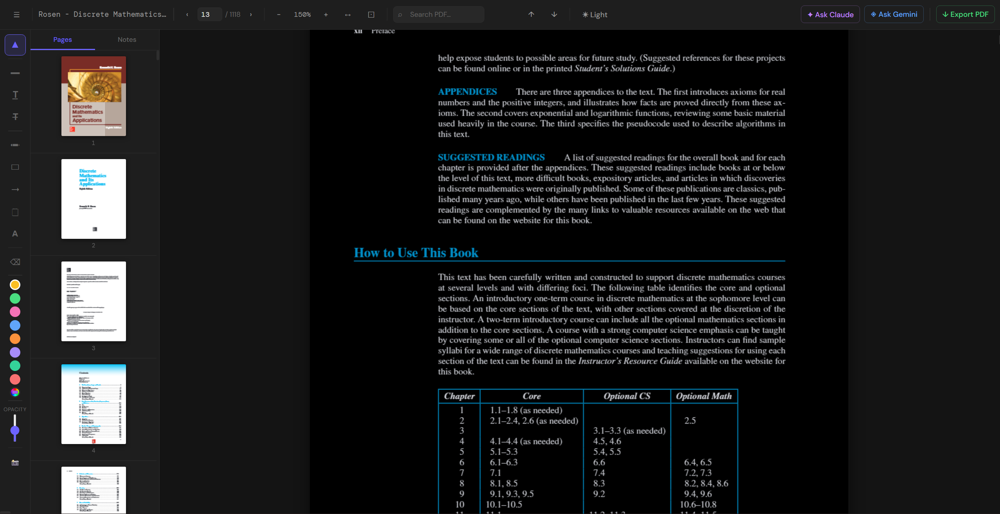
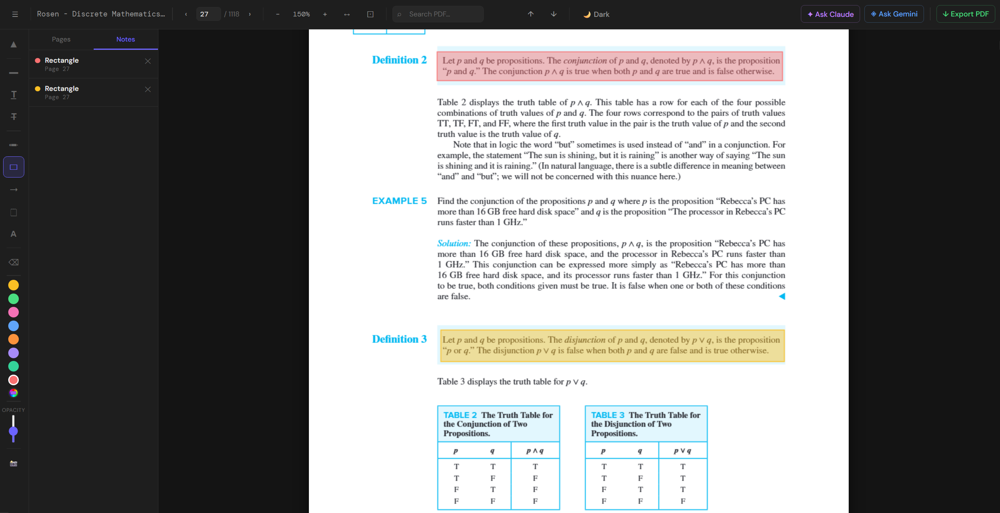
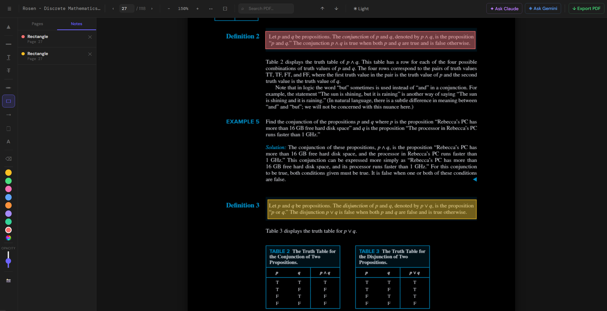
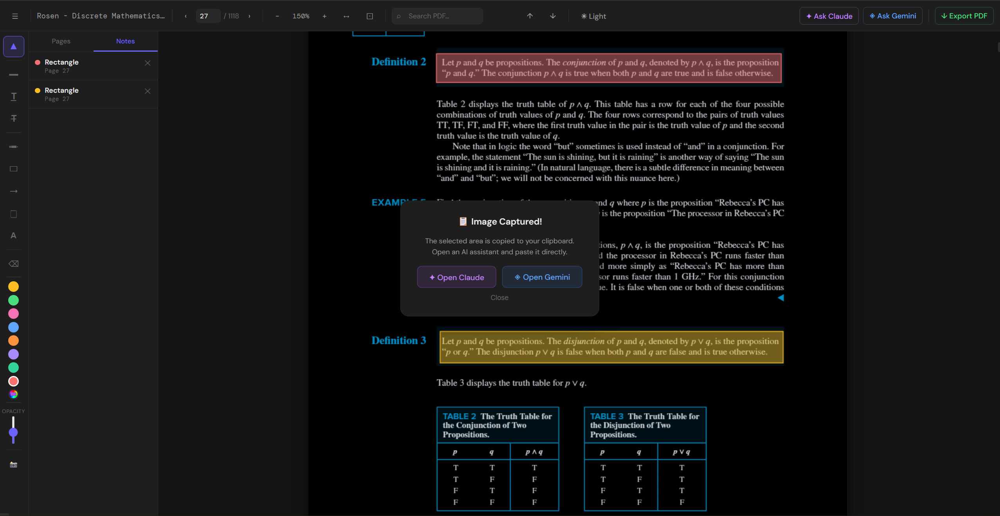

# 🌙 Scholar: Dark Mode PDF Viewer

A robust, Manifest V3 browser extension designed to natively render and display PDF files in a comfortable dark mode environment. 

### 👁️ Visual Comparison

| Scholar Extension (Light) | Scholar Extension (Dark) |
| :---: | :---: |
|  |  |
|  |  |

**AI Integration in Action:**


### ✨ Comprehensive Feature List

**Core Viewing Experience**
* **Seamless Interception:** Automatically intercepts and opens all PDFs in the browser (supports both local files and web URLs).
* **Theme Toggle:** Instantly switch between Dark mode and Light mode with a single toolbar click.
* **High-Performance Lazy Rendering:** Instantly loads massive documents (1000+ pages) by rendering pages only as you scroll to them.
* **Advanced Zoom & Layout:** Zoom in/out via UI buttons, Ctrl+Scroll, Fit Width, and Fit Page options.
* **Quick Navigation:** Jump directly to specific pages using inputs, Prev/Next buttons, or smooth scroll-to-page navigation. 

**Sidebar & Organization**
* **Thumbnail Panel:** Lazy-rendered page previews for quick visual navigation—click any thumbnail to jump directly to that page.
* **Annotations Panel:** Centralized list of all your annotations, complete with page numbers, color-coded dots, and one-click deletion.
* **Collapsible UI:** Easily toggle the sidebar open or closed for a distraction-free workspace.

**Annotation & Markup Tools**
* **Text Markup:** Highlight, underline, and strikethrough selected text.
* **Freehand Pen:** Draw freely anywhere on the document.
* **Shapes & Vectors:** Draw filled/outlined rectangles and directional arrows.
* **Notes & Text:** Add draggable sticky notes (yellow post-its) and floating, editable text labels anywhere on the page.
* **Smart Eraser:** Simply hover over any drawing or markup to instantly erase it.

**Color & Opacity Control**
* **Custom Palettes:** 8 quick-select preset colors (yellow, green, pink, blue, orange, purple, teal, red) plus a full custom color picker wheel.
* **Opacity Slider:** Fine-tune the transparency for all drawing and markup tools.

**Search Capabilities**
* **Live Full-Text Search:** Instantly search across the entire PDF document.
* **Visual Match Tracking:** All matches are highlighted in yellow with Prev/Next navigation and match count display.

**AI Integration (Zero-Config)**
* **Text-to-AI:** Select any text and use "Ask Claude" or "Ask Gemini" to automatically copy the text and launch the respective AI in a new tab.
* **Area Capture (📸):** Draw a bounding box over diagrams, equations, or images to copy them as a screenshot directly to your clipboard, followed by a quick-launch dialog to paste them into Claude or Gemini.

**Export & Save**
* **Bake-In Export:** Download your fully annotated PDF. All highlights, drawings, text, and shapes are permanently baked into the file using `pdf-lib`.

### 🛠 Architecture & Workflow
Instead of relying on simple CSS inversion (which often ruins images and breaks formatting), this extension intercepts PDF files and renders them within a custom HTML viewer using Mozilla's `pdf.js` and `pdf-lib`. 

**Development Process:** The core logic, library integration strategy, and file structure were architected by me to solve my own reading needs. The syntax, boilerplate generation, and rapid iteration were executed using AI assistance (Gemini / Claude).

### ⚙️ Core Technologies
* **Manifest V3:** Adheres to modern browser extension standards (`background.js` service workers).
* **PDF.js:** Core rendering engine for accurate document display.
* **PDF-lib:** Handles deeper PDF manipulation and processing.

### 📦 Installation (Developer Mode)

1. **Clone the repository:**
   ```bash
   git clone https://github.com/Kavy-Ondhia/scholar-pdf-viewer.git
   ```

2. **Setup Libraries:** Run the included batch script to ensure the necessary libraries are downloaded into the `/lib` directory.
   ```bash
   ./SETUP_download_libs.bat
   ```

3. **Load into Browser:**
   * Open a Chromium-based browser (Chrome, Edge, Brave) and navigate to `chrome://extensions/`
   * Toggle on **Developer mode** (top right).
   * Click **Load unpacked** and select the directory containing the cloned repository.

### 💡 Usage
Once enabled, the extension actively listens for PDF file requests and redirects them to the custom `viewer.html`, automatically applying the dark mode rendering logic defined in `app.js`.
